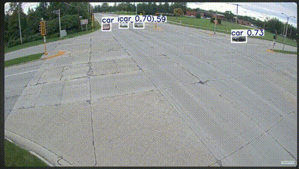

# SmartVision App [Click Here](https://smart-vision-1058693665617.europe-west1.run.app/)
### Author: Virendrasinh Chavda

<p align="justify">
This repository contains a cutting-edge computer vision application built with Streamlit and YOLOv11 models. The app allows users to perform object detection, segmentation, and pose estimation on images or videos. With an interactive interface, users can upload files or use live camera input to see real-time predictions.
</p>


---

## Table of Contents
1. [Overview](#Overview)
2. [Installation](#Installation)
3. [Features](#Features)
4. [Usage](#Usage)
5. [Methodology](#Methodology)
6. [Future Work](#Future-Work)
7. [Contributing](#Contributing)
8. [License](#License)

---

## Overview
<p align="justify">
SmartVision App is a versatile vision-based tool designed for object detection, object segmentation, and pose estimation. By leveraging YOLOv11 models, the app provides real-time predictions with high accuracy. It supports images, videos, and live camera input, making it ideal for researchers, developers, and enthusiasts interested in computer vision.
</p>

---

## Installation

To set up and use this project, follow these steps:

1. Clone the repository:
   ```bash
   git clone https://github.com/your-repo/smartvision-app.git
   cd smartvision-app
   ```
